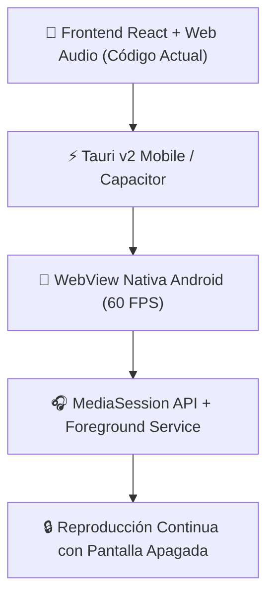

# 📱 Hoja de Ruta: Adaptación de Ambiencer Pro a Android (Google Play Store)

> **Objetivo:** Llevar el mezclador de sonidos ambientales y frecuencias binaurales 100% offline de Ambiencer Pro a celulares Android reutilizando el motor Web Audio + React actual, manteniendo cero consumo de internet y consumo mínimo de batería.

---

## 🏗️ 1. Arquitectura Técnica Recomendada



| Capa | Tecnología Seleccionada | Justificación |
| :--- | :--- | :--- |
| **Frontend UI & Audio** | **React + Web Audio API** *(Código actual)* | Cero reescritura. El motor de audio y la mezcla sintetizada funcionan 100% en WebView Android. |
| **Wrapper Nativo** | **Tauri v2 Mobile** *(o Capacitor)* | Utiliza la infraestructura de Tauri v2 ya instalada para empaquetar en `.aab` / `.apk`. |
| **Segundo Plano** | **Android Foreground Media Service** | Garantiza que Android no corte el audio cuando la pantalla se apaga o se bloquea. |

---

## 🛠️ 2. Fases de Desarrollo Paso a Paso

### 📍 Fase 1: Adaptación de la Interfaz (Layout Móvil Vertical)
1. **Layout Responsive (9:16):**
   - Adaptar las tarjetas del mezclador de sonidos y frecuencias binaurales para pantallas verticales de smartphones.
   - Ocultar los widgets de escritorio exclusivos de Windows y priorizar la vista de Mezclador + Temporizador de Apagado (Sleep Timer).
2. **Controles Táctiles (Touch-Friendly):**
   - Optimizar los faders y perillas de volumen para gestos táctiles fluidos.

---

### 📍 Fase 2: Configuración del Entorno Móvil (Tauri Mobile)
1. **Inicialización de Android:**
   ```bash
   # Inicializar soporte de Android en el proyecto Tauri v2
   npx tauri android init
   ```
2. **Generación del Proyecto Android Studio:**
   - Tauri creará la carpeta nativa en `src-tauri/gen/android`.

---

### 📍 Fase 3: Integración de Audio en Segundo Plano (Screen Off Audio)
Para evitar que Android suspenda el proceso al apagar la pantalla:

1. **Habilitar `MediaSession API` en JS:**
   - Permite que el sistema Android muestre el reproductor en la pantalla de bloqueo y en la barra de notificaciones.
2. **Wakelock de Audio & Permisos Android:**
   - Declarar permisos en `AndroidManifest.xml`:
     - `<uses-permission android:name="android.permission.FOREGROUND_SERVICE" />`
     - `<uses-permission android:name="android.permission.WAKE_LOCK" />`

---

### 📍 Fase 4: Optimización de Peso de Assets
1. **Compresión de Archivos de Sonido:**
   - Convertir los assets de sonido a formato `.ogg` / `.webm` (64-96 kbps). Esto reduce el tamaño total de la app a menos de ~25 MB.
2. **Modo 100% Offline:**
   - Todos los audios permanecen almacenados localmente dentro del paquete de la app.

---

### 📍 Fase 5: Compilación & Publicación en Google Play
1. **Generación del Bundle de Producción:**
   ```bash
   # Generar archivo AAB para Google Play Console
   npx tauri android build --bundle aab
   ```
2. **Firma de la App (Keystore):**
   - Generar clave digital `.keystore` para firmar el paquete para Google Play Store.
3. **Publicación en Google Play Console:**
   - Subida del `.aab`, capturas de pantalla de móvil y ficha de tienda.

---

## 💡 Ventajas de este Enfoque
- **90% de Reutilización de Código:** No es necesario programar una app de cero en Kotlin/Java.
- **Mapeo del Ecosistema Yeib:** Se puede enlazar con la versión de PC o venderse como app standalone en Google Play.
- **Rendimiento Ultraliviano:** Inicio instantáneo y cero consumo de datos móviles.

---

© 2026 **Yeib Ecosystem** — High-Performance Mobile Ambient Soundscapes.
